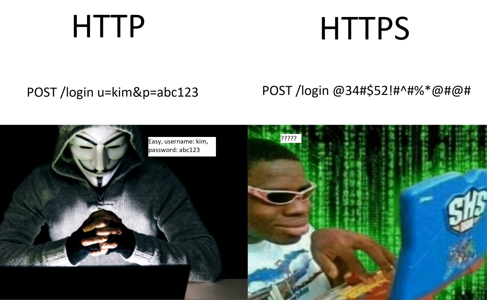

## Asas Laman Web
*Website* atau lebih dikenali sebagai laman sesawang. Merupakan *landing page* yang mempunyai *domain name server* ([*DNS*](#domain)) dan diterbitkan di sekurang-kurangnya satu *web server*. Contoh yang terkenal adalah seperti: `google.com`, `twitter.com`, `github.com`.

Semua laman web yang boleh diakses secara terbuka merupakan *Word Wide Web* (*www*). Terdapat juga laman web peribadi yang hanya dapat diakses di rangkaian peribadi seperti laman web dalaman syarikat, ataupun laman web yang menggunakan servis [Apache](../apache) melalui pemasangan [XAMPP](../xampp) dalam komputer atau laptop anda.

Laman web biasanya dikhaskan untuk topik atau tujuan tertentu, seperti berita, pendidikan, perdagangan, hiburan atau jaringan sosial. Pautan antara laman web yang digunakan sering dimulakan dengan halaman utama.

Pengguna dapat mengakses laman web menggunakan pelbagai peranti termasuk komputer, laptop, tablet dan telefon pintar. Aplikasi perisian yang digunakan dipanggil penyemak-imbas jaringan ([*web browser*](../web-browser)).

Untuk pengaturcaraan laman web, anda boleh menggunakan [*text-editor*](../text-editor) seperti Notepad yang sedia ada dalam *OS Windows*, ataupun aplikasi lain seperti Notepad++, Visual Studio Code, Atom, Sublime, Vim, Nano, Bracket, dan sebagainya. Kenapa tidak menggunakan WordPress ataupun Wix? WordPress bukanlah *text-editor*, ia adalah laman web yang memberikan kemudahan kepada pengguna untuk proses pembanggunan laman web secara *Graphical User Interface* ([GUI](../gui)) tanpa perlu mengetahui ilmu pengaturcaraan. Pengguna hanya perlu *drag & drop* untuk menyiapkan sebuah laman web.

## Domain
Seperti yang sedia maklmum, *domain* adalah nama laman web yang ditulis pada *address bar*, anda juga boleh menulis ip-address laman web tersebut. Fungsi DNS adalah sama seperti ip-address. Cuma, untuk manusia. Perkataan seperti `google.com` lebih mudah dihafal berbanding `172.217.174.174`.

```
https://www.example.com.my/user/index.html?id=123&name=kim
```

<table>
    <tr>
        <th>Bahagian</th>
        <th>Fungsi</th>
        <th>Penjelasan</th>
    </tr>
    <tr>
        <td>https://</td>
        <td>Protocol</td>
        <td>Protokol komunikasi adalah sistem peraturan yang membolehkan dua atau lebih entiti sistem komunikasi menghantar maklumat melalui jenis variasi kuantiti fizikal. Untuk penjelasan lanjut mengenai HTTP, boleh baca di bahagian <a href="#http-vs-https">HTTP vs HTTPS</a></td>
    </tr>
    <tr>
        <td>www</td>
        <td>Sub Domain</td>
        <td>Dalam hierarki Sistem Nama Domain, subdomain merupakan pecahan domain dibawah domain utama.</td>
    </tr>
    <tr>
        <td>example</td>
        <td>Domain Name Server (DNS)</td>
        <td> Nama domain digunakan dalam pelbagai konteks rangkaian dan untuk tujuan penamaan dan alamat khusus aplikasi.</td>
    </tr>
    <tr>
        <td>.com</td>
        <td>Top-level Domain (TLD)</td>
        <td>Sesiapa sahaja boleh daftar untuk TLD <code>.com</code> - commercial ini. Manakala TLD yang terkawal seperti <code>.org</code> - organization, <code>.edu</code> - education, <code>.gov</code> - goverment hanya boleh didaftarkan oleh pertubuhan rasmi sahaja.</td>
    </tr>
    <tr>
        <td>.my</td>
        <td>Country Code Top-level Domain (ccTLD)</td>
        <td>ccTLD dikhususkan untuk negara, semua ccTLD terdiri daripada 2 huruf sahaja. Berikut merupakan senarai ringkas:<br><code>.my</code> - malaysia<br><code>.id</code> - indonesia <br><code>.jp</code> - jepun<br><code>.ru</code> - rusia<br> *Untuk mempunyai TLD <code>.my</code>, pemilik domain perlu mempunyai <a href="https://en.wikipedia.org/wiki/Companies_Commission_of_Malaysia#:~:text=The%20Companies%20Commission%20of%20Malaysia,and%20business%20affairs%20in%20Malaysia.">Suruhanjaya Syarikat Malaysia (SSM)</a> terlebih dahulu.</td>
    </tr>
    <tr>
        <td>/user/</td>
        <td>path folder</td>
        <td>Sekiranya folder tidak wujud, laman web akan menunjukkan laman <code>error 404 not found</code> menandakan path atau file tidak wujud. </td>
    </tr>
    <tr>
        <td>index.html</td>
        <td>file</td>
        <td>Semua laman web menggunakan <code>index</code> sebagai halaman utama mereka. boleh jadi: <code>.html</code>, <code>.php</code>, <code>.js</code>, <code>.aspx</code> </td>
    </tr>
    <tr>
        <td>?id=123&name=kim</td>
        <td>query parameter</td>
        <td>Dimulakan dengan simbol <code>?</code> dan dipisahkan dengan simbol <code>&</code>, disini kita dapat lihat terdapat dua query yang telah ditulis iaitu: <code>id=47</code> dan <code>name=kim</code></td>
    </tr>
</table>


## HTTP vs HTTPS
Hypertext Transfer Protocol (HTTP) adalah protokol lapisan aplikasi untuk menghantar dokumen hipermedia, seperti HTML. Ia dirancang untuk komunikasi antara pelayar web dan pelayan web, tetapi juga dapat digunakan untuk tujuan lain.
Manakala HTTPS pula adalah Hypertext Transfer Protocol Secure, fungsinya sama seperti HTTP cuma ditambahkan *encryption*. Supaya penggodam tidak dapat memahami komunikasi antara client dan server.
